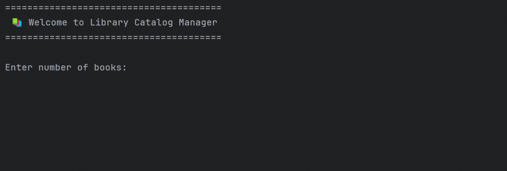
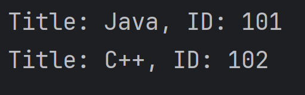

# 🗂️ Library Catalog Manager

A simple yet efficient Java console application for managing a small library of books. Add book details, list them, and search by ID or title — all in a beginner-friendly command-line interface.

---

## ✨ Features

- 📘 Add books with title and ID  
- 📋 View all books in the catalog  
- 🔍 Search by **Book ID**  
- 🔎 Search by **Book Title** (case-insensitive)  
- 💡 Clean, user-friendly console interface


---

## 🖥️ Demo

Below are visuals showing how the Library Catalog Manager works.

| 📌 Action | 🎞️ Visual |
|----------|------------|
| 1️⃣ Add Books (Title & ID) |  |
| 2️⃣ View Book List Output |  |
| 3️⃣ Search by ID & Title |  |


---

## 🚀 Getting Started

### ✅ Prerequisites

- IDE like IntelliJ IDEA (optional but recommended)

### ▶️ How to Run

1. Open terminal in the project folder.
2. Compile the code:
 
```
javac LibraryCatalogManager.java
```

3. Run the program:

```
java LibraryCatalogManager
```

---

> 💡 Using IntelliJ IDEA?
Just open the project, open LibraryCatalogManager.java, and click the Run button.

---

📚 More Projects <br>
Check out more of my projects on my [GitHub profile](https://github.com/Saswat-King)
